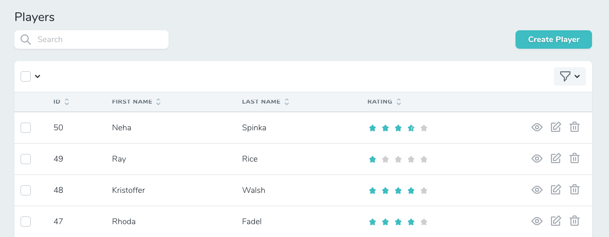

# Nova Rating field

A **Star rating field** to use in your Laravel Nova apps. 

Uses [vue-star-rating](https://github.com/craigh411/vue-star-rating). 

[](https://packagist.org/packages/nikaia/nova-rating-field)
[](https://packagist.org/packages/nikaia/nova-rating-field)


<p align="center">
    
    <br/>
    
</p>


## Installation

You can install the package in to a Laravel app that uses [Nova](https://nova.laravel.com) via composer:

```bash
composer require nikaia/nova-rating-field
```

Next you can use the `Nikaia\Rating\Rating` field in your Nova resource.

## Usage

```php
public function fields(Request $request)
{
    return [
        // ...

        Rating::make('Rating')->min(0)->max(5)->increment(0.5)->hideFromIndex(),
        
        // Defining a custom style for the index page.
        Rating::make('Rating')->min(0)->max(5)->increment(0.5)->hideRating()
            ->withStyles([
                'star-size' => 15,
                'rounded-corners' => true,
            ])->onlyOnIndex()->sortable(),

        // ...    
        
    ];
}
```

### Defining properties

```php
public function fields(Request $request)
{
    Rating::make('Rating')
    
        // Miniumum rating (default: 0)
        ->min(0) 
        
        // Maximum rating (default: 5)
        // This is how the component knows how many stars it should display.
        ->max(5)
        
        // Incremet (default: 1)
        // Can be float. The underlying eloquent colum must be defined as float in that case.
        // ie. 0.5 for half stars or 0.01 for fluid stars.
        ->increment(0.5)
        
        // Show rating value next to the stars
        ->hideRating()
        
}
```

### Customizing styles

You can style the component using `withStyles` method. Options are passed to the the underlying [vue component style props](https://github.com/craigh411/vue-star-rating#style-props). 

Default values are :

```php
public function fields(Request $request)
{
    Rating::make('Rating')
        ->withStyles([
            'star-size' => 30,
            'active-color' => 'var(--primary)', // Primary nova theme color.
            'inactive-color' => '#d8d8d8',
            'border-color' => 'var(--60)',
            'border-width' => 0,
            'padding' => 10,
            'rounded-corners' => false,
            'inline' => false,
            'glow' => 0,
            'glow-color' => '#fff',
            'text-class' => 'inline-block text-80 h-9 pt-2',
        ]);
}
```
